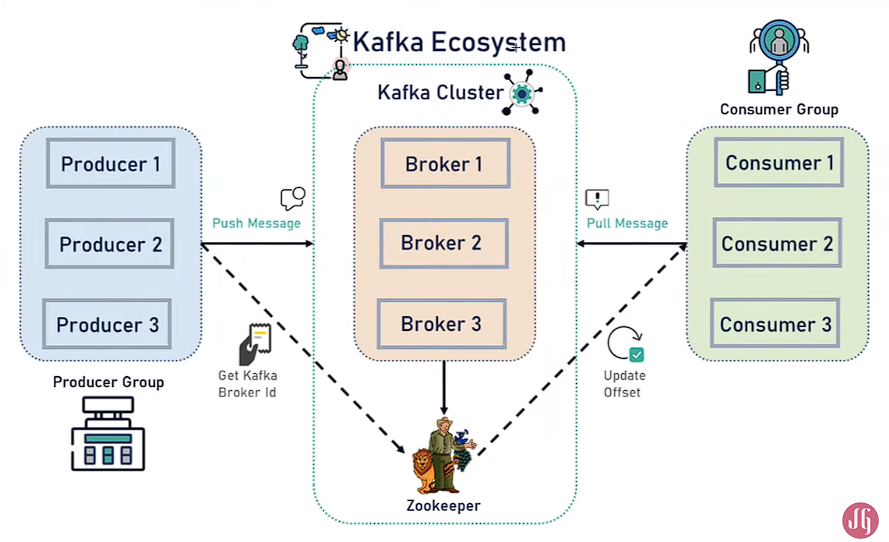
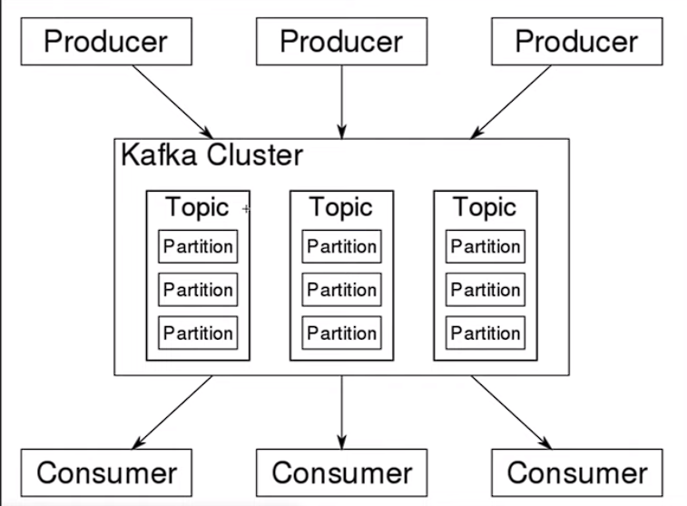

Для того, чтобы запустить проект на kafka вам понадобится выполнить следующие шаги:
    1. Установить kafka с официального сайта под вашу систему.
    2. https://www.apache.org/dyn/closer.cgi?path=/kafka/3.4.0/kafka_2.13-3.4.0.tgz
    3. Если у вас macOS следуйте инструкции на сайте. Если у вас windows идём дальше по пунктам.
    4. Устанавливаем JDK/JRE выше 8. Добавляем CLASSPATH в переменные среды windows и вставляем путь к bin jdk. 
    5. Для начала запустим zookeeper в новой сессии. 
    ```.\bin\windows\zookeeper-server-start.bat .\config\zookeeper.properties```. Если старт прошёл успешно, вы увидите строчку с портом 2181.
    6. Теперь запустим kafka-server в новой сессии. 
    ``.\bin\windows\kafka-server-start.bat .\config\server.properties``. Если все прошло успешно, вы увидите строку с портом 9092.
    7. Теперь для проверки создадим топик. 
    ``.\bin\windows\kafka-topics.bat --create --topic topic-example --bootstrap-server localhost:9092``. Если все прошло успешно мы увидим строку о создании топика.
    8. Добавляем события в топик через producer. 
    ``.\bin\windows\kafka-console-producer.bat --topic topic-example --bootstrap-server localhost:9092``.
    9. И считываем события при помощи consumer ``.\bin\windows\kafka-console-consumer.bat --topic topic-example --from-beginning --bootstrap-server localhost:9092``.
    10. МЫ должны увидеть наши добавленные сообщения по порядку. Congratulations.






После того, как написали простую конфигурацию и создали kafka produer с простым RestAPI, отправляем запрос на http:localhost:8080/api/v1/kafka/publish?message=hello world.
Повторяем пункт 9 из инструкции сверху и смотрим, добавляется ли наше сообщение в созданный топик. Если мы видим наше сообщение - значит все гуд.

